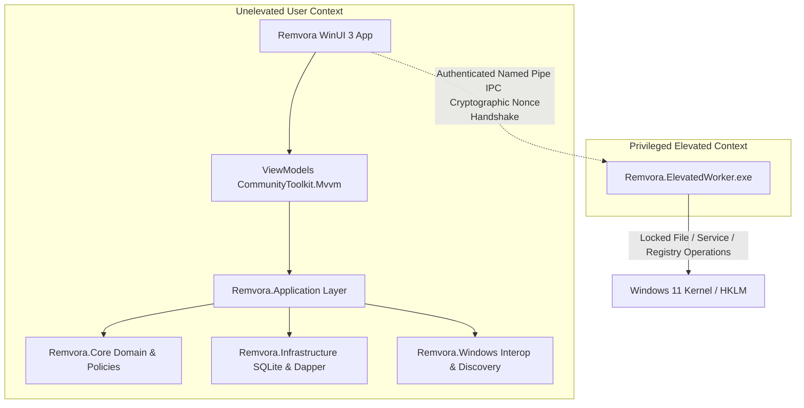

<p align="center">
  
</p>

<h1 align="center">Remvora</h1>

<p align="center">
  <strong>Native Windows 11 Uninstaller, Installation Monitor & System Maintenance Suite</strong>
</p>

<p align="center">
  <a href="#"></a>
  <a href="#"></a>
  <a href="#"></a>
  <a href="#"></a>
  <a href="#"></a>
  <a href="#"></a>
</p>

**Remvora** is a modern, high-performance uninstaller and system cleanup utility engineered for Windows 11 and Windows 10 (x64 and ARM64). Built with **WinUI 3** and **.NET 10**, Remvora prioritizes safety, complete transparency, transactional rollback recovery, and deterministic evidence-based leftover removal.

---

## Key Capabilities & Navigation

Remvora provides an integrated suite of maintenance tools accessible through the left navigation pane:

| Menu | Purpose | Key Features |
| :--- | :--- | :--- |
| **Dashboard** | System health at a glance | Summary statistics of installed applications, total junk cache size, startup load score, and one-click quick actions. |
| **Installed Apps** | Comprehensive application uninstaller | Aggregates 32-bit, 64-bit, and MSI installations. Supports **Standard**, **Complete**, and **Forced** uninstallation flows with System Restore checkpoints and interactive leftover candidate review. |
| **Install Monitor** | Real-time installation tracking engine | Monitors third-party setup packages (`.exe` / `.msi`). Captures baseline snapshots, tracks every file and registry entry written in real time, and saves installation logs for 100% clean future uninstallation. |
| **Windows Apps** | Modern packages manager | Discovery, filter, and removal of Universal Windows Platform (UWP) and AppX/MSIX provisioned packages. |
| **Startup Manager** | Boot optimizer & autorun controller | Inspects and manages startup entries across Registry Run keys (`HKCU`/`HKLM`), Windows Startup folders, and Task Scheduler triggers with instant toggle controls. |
| **System Cleaner** | Storage reclamation & privacy suite | Safe junk file cleaner (temporary folders, crash dumps, thumbnail caches) and privacy cleaner (MRU lists, run history, Explorer caches). |
| **Hunter Mode** | Desktop crosshair targeting | Desktop overlay targeting widget. Drag onto any visible window, desktop icon, or system tray icon to identify the process, force-close stubborn apps, or launch targeted uninstallation. |
| **Windows Tools** | System administration hub | One-click quick launcher for 16 native Windows utilities (Task Manager, Services, Event Viewer, Disk Management, Group Policy, Registry Editor, etc.). |
| **Audit Log** | Forensic operation history | Chronological, searchable timeline and transaction log of every uninstallation, cleanup, and rollback action, persisted in local SQLite. |

---

## Architectural Highlights



1. **Strict Privilege Separation**: Remvora's graphical interface runs strictly unelevated (standard user privileges). When privileged actions are needed (e.g. deleting locked services or `HKLM` keys), an isolated out-of-process worker (`Remvora.ElevatedWorker.exe`) is launched on-demand via authenticated Named Pipe IPC with cryptographically secure nonce verification.
2. **Deterministic Evidence Scoring**: Leftovers are identified using weighted evidence rules rather than naive substring matching, eliminating false positives on shared runtime libraries.
3. **Protected Paths Policy**: Hardened safety boundaries strictly protect core Windows folders (`Windows`, `System32`, `WinSxS`), boot files, and essential hives against accidental modification or directory traversal (`..`) attacks.
4. **Transaction Backups & Atomic Rollback**: Files are staged in an isolated backup store and registry modifications are backed up to `.reg` format before deletion, allowing one-click rollback from the Audit Log.

---

## Repository Structure

Remvora follows Clean Layered Architecture with clean separation of concerns:

```
Remvora/
├── docs/                      # Comprehensive engineering documentation & assets
│   ├── assets/                # High-resolution logos, emblems, and media
│   ├── architecture.md        # Architectural blueprint and subsystem layers
│   ├── decisions.md           # Architecture Decision Records (ADRs)
│   ├── safety-model.md        # System protection and privilege boundary model
│   └── walkthrough.md         # Milestone walkthrough and test logs
├── scripts/                   # Turnkey PowerShell management scripts
│   ├── install.ps1            # Local Windows application installer
│   ├── package-releases.ps1   # Multi-architecture packaging engine
│   ├── uninstall.ps1          # Clean application uninstaller
│   └── update-icons.ps1       # Icon pipeline generating multi-resolution ICO & assets
├── src/                       # Production application source code
│   ├── Remvora.App/           # WinUI 3 desktop user interface
│   ├── Remvora.Application/   # Application use cases, workflows & orchestration
│   ├── Remvora.Contracts/     # IPC protocols, DTOs & security contracts
│   ├── Remvora.Core/          # Domain models, scoring & safety policies
│   ├── Remvora.Elevation/     # Isolated elevated worker process
│   ├── Remvora.Infrastructure/# SQLite persistence, repositories & migrations
│   └── Remvora.Windows/       # Win32/COM interop, registry & MSI accessors
├── tests/                     # Automated unit and integration test suites
│   ├── Remvora.Application.Tests/
│   ├── Remvora.Contracts.Tests/
│   ├── Remvora.Core.Tests/
│   ├── Remvora.Infrastructure.Tests/
│   └── Remvora.Windows.Tests/
├── .gitignore                 # Leak-proof ignore rules for secrets, caches & binaries
├── Directory.Build.props      # Solution-wide C# 14 & Roslyn analyzer rules
├── README.md                  # Project overview and documentation
└── Remvora.slnx               # Modern solution definition
```

---

## Multi-Architecture Releases

Remvora natively targets all primary Windows hardware architectures:

| Target Architecture | Platform Description | Runtime Identifier | Distribution Artifact |
| :--- | :--- | :--- | :--- |
| **Windows x64** | Standard 64-bit PCs (Intel Core, AMD Ryzen) | `win-x64` | `Remvora-v<version>-win-x64.zip` |
| **Windows ARM64** | ARM-powered PCs (Snapdragon X Elite, Surface Pro Copilot+) | `win-arm64` | `Remvora-v<version>-win-arm64.zip` |
| **Windows x86** | 32-bit legacy Windows environments | `win-x86` | `Remvora-v<version>-win-x86.zip` |

### Distribution Architecture Layout

When an end-user downloads and extracts any of the release archives, the root folder is clean and free of loose DLL clutter:

```
Remvora-v1.2.2-win-x64/
├── Remvora.exe        # Clean root launcher with embedded high-resolution icon
├── install.ps1        # Turnkey PowerShell installer with Start Menu & registry integration
├── uninstall.ps1      # Clean uninstaller script
└── app/               # Isolated container housing all application binaries and runtimes
    ├── Remvora.App.exe
    ├── Remvora.ElevatedWorker.exe
    └── ... (all internal DLLs and resources)
```

### Packaging Architecture Distributions

Generate all clean release zip archives locally in one command:
```powershell
.\scripts\package-releases.ps1 -Version "1.2.2"
```
This packages each architecture into the `/releases` directory accompanied by `checksums-sha256.txt`.

---

## How to Install & Run Remvora

### Option 1: Automated Local Installation (Recommended)

Remvora includes a turnkey PowerShell installation script that compiles self-contained binaries, installs them to your local user directory (`%LocalAppData%\Programs\Remvora`), creates a Start Menu shortcut with the application icon, and registers Remvora in **Windows Settings > Apps > Installed Apps**:

```powershell
# Run from the repository root:
.\scripts\install.ps1
```

*Helpful Parameters:*
- `.\scripts\install.ps1 -CreateDesktopShortcut` : Creates an optional desktop icon.
- `.\scripts\install.ps1 -Scope System` : Installs system-wide to `Program Files` (requires Administrator).
- `.\scripts\install.ps1 -SkipBuild` : Installs directly from an existing build.

To cleanly remove Remvora:
```powershell
.\scripts\uninstall.ps1
```
*(Or use Windows Settings > Apps > Installed Apps > Remvora > Uninstall).*

---

### Option 2: Run in Development Mode

Run directly from source without installing:

```powershell
dotnet run --project src/Remvora.App/Remvora.App.csproj
```

---

### Option 3: Manual Self-Contained Release Build

To produce a self-contained portable folder:

```powershell
# 1. Publish main application
dotnet publish src/Remvora.App/Remvora.App.csproj -c Release -r win-x64 --self-contained -o ./publish/Remvora

# 2. Publish elevated worker
dotnet publish src/Remvora.Elevation/Remvora.Elevation.csproj -c Release -r win-x64 --self-contained -o ./publish/Remvora

# 3. Launch Remvora
.\publish\Remvora\Remvora.App.exe
```

---

## Testing & Quality Assurance

Run the automated test suite covering all layers (Core, Contracts, Application, Infrastructure, Windows):

```powershell
dotnet test Remvora.slnx
```

- **5 Test Projects**: `Remvora.Core.Tests`, `Remvora.Contracts.Tests`, `Remvora.Application.Tests`, `Remvora.Infrastructure.Tests`, `Remvora.Windows.Tests`
- **117 automated tests**: 100% passing with 0 warnings and 0 errors under Roslyn `latest-recommended` code quality analyzers.

---

## System Requirements

- **Operating System**: Windows 11 (build 22000+) or Windows 10 (build 1809+), 64-bit or ARM64 architecture.
- **Development Tooling**: .NET 10 SDK and Windows App SDK.
